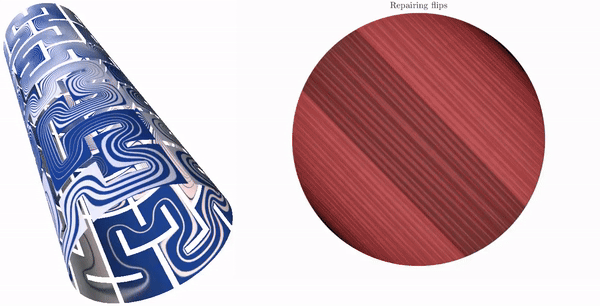
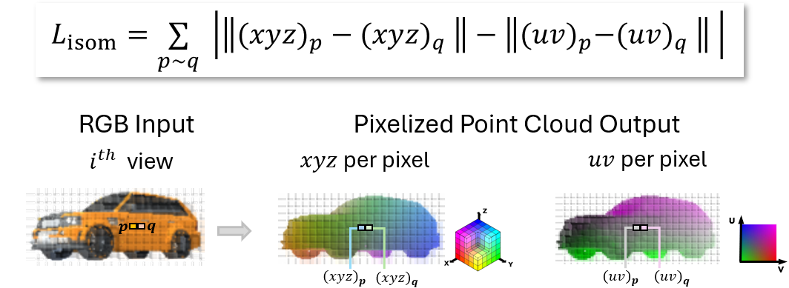
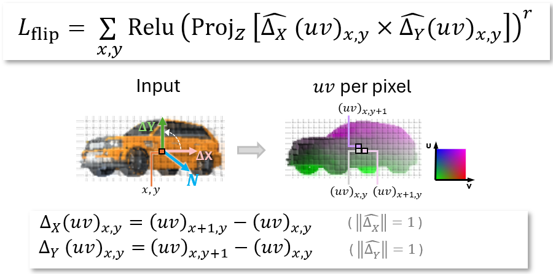
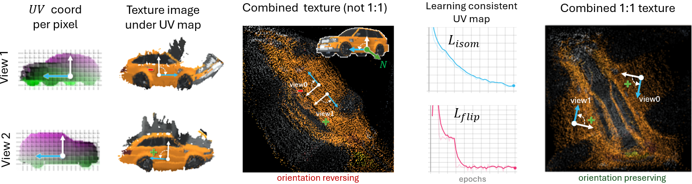

# UVmap_pix2surf
Learnable UV maps for 3D reconstruction implemented for multi-view network based on [Pix2Surf](https://github.com/JiahuiLei/Pix2Surf) architecture.

## Introduction  
In classical geometry processing methods, distortion measures assess the quality of UV mapping over 3D meshes to obtain textures without visual artifacts such as metric distortions, foldovers, etc. UV mappings that minimize these measures result in better texture mapping and better overall shape of the UV-image aligned with the internal structure of the 3D object.

For example, here is how minimizing local isometric distortion converts an initially highly distorted UV mapping of a developable surface into the length-preserving unfolding aligned with principal directions:


 
 ## The method
The main advantage of classical distortion measures for UV mappings is that while these distortions are defined locally as a sum over finite elements of the 3D object, the minima of these measures exhibit essential global properties such as orientation preservation and injectivity.

However, the main disadvantage of these measures is that they are too complicated to be integrated into neural networks.

This work introduces a **differentiable approximation of UV map distortion** measures for various 3D reconstruction networks, including multi-view networks that output pixelized point cloud representations of 3D objects.


In particular, we introduce a distortion loss with two components:
* The first one is defined as the deviation between the UV distances of neighboring pixels (p and q) and the distances of their reconstructed points in 3D:


* The 2nd component penalizes inverted orientation induced by  UV map: 
    *  the order of the cross product doesn't matter because either a clockwise or counterclockwise direction can be chosen as the positive orientation. What’s important is maintaining consistent orientations across all pixels and views



> The final loss to supervise  UV map is the sum of *(L_isom + L_flip)*  over all views 


**Explanation:** A positive surface orientation, defined by the outward normal, induces a positive orientation in the UV domain under injective UV maps. If this orientation is not preserved, the UV map is no longer 1:1, resulting in overlaps in the texture image and leading to information loss in texture representation. Without these corrective losses, the original network typically learns only a partial, incomplete unwrapping of the texture.


These losses converge quickly when added to the network, leading to better accuracy in 3D reconstruction. Most importantly, adding these losses fixes texture overlaps and reduces visual distortions.

 ## Setup
 Follow [these](https://github.com/JiahuiLei/Pix2Surf?tab=readme-ov-file#installation)  instructions to set up the environment and run the code.

## Additional Resources   and Future Work
While the code is designed for pixelized multi-view networks, the proposed method is also applicable to other reconstruction methods, including more general point cloud methods and mesh-based methods.
* For a summary of  distortion measures used in geometry  processing application, see this [survey](https://alexnaitsat.github.io/html/projects/dist_inv_mapping/dist_inv_mapping_preprint.pdf)
* For an example of a classical algorithm for distortion optimization over 3D objects, see [this method](https://github.com/AlexNaitsat/ABCD_Algorithm)
* This [repo](https://github.com/AlexNaitsat/symmetric_mcmr) implements a closely related method of  *learnable symmetries* and shows how it can be integrated with learnable UV maps from this   repository

 **[[Learnable symmetries for 3D reconstruction](https://github.com/AlexNaitsat/symmetric_mcmr)]** &nbsp; **[[Pix2Surf network](https://github.com/JiahuiLei/Pix2Surf)]** &nbsp;  **[[Survey on distortion optimization](https://alexnaitsat.github.io/html/projects/dist_inv_mapping/dist_inv_mapping_preprint.pdf)]**


## Citation
  Consider citing this work if you find it useful
```
@misc{naitsat2022,
  author = {Naitsat, A.},
  title = {Learnable UV maps for 3D reconstruction},
  howpublished = {\url{https://github.com/AlexNaitsat/UVmap_pix2surf}},
  }
```
